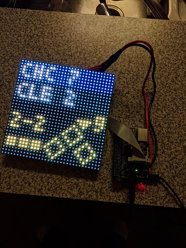
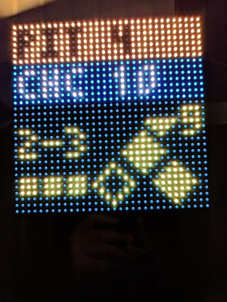
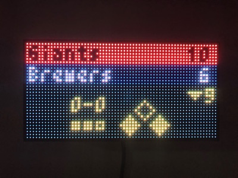
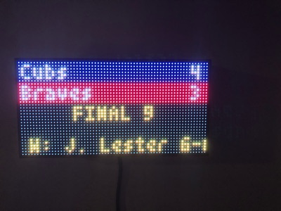
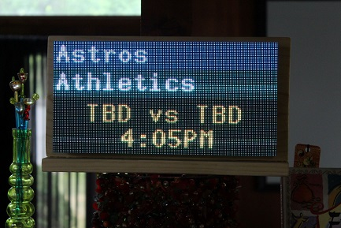
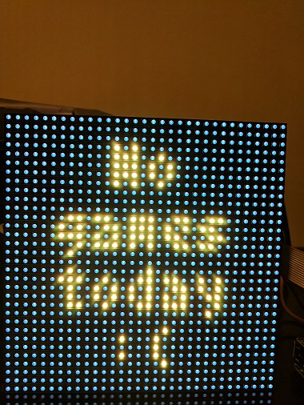
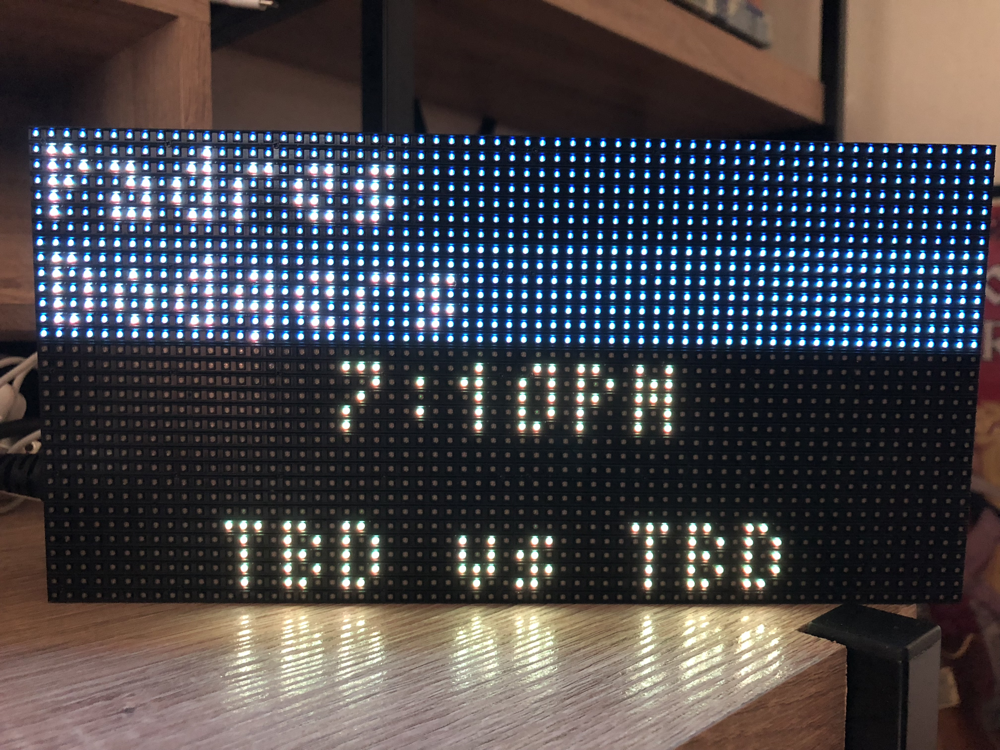
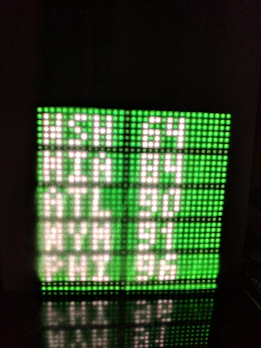
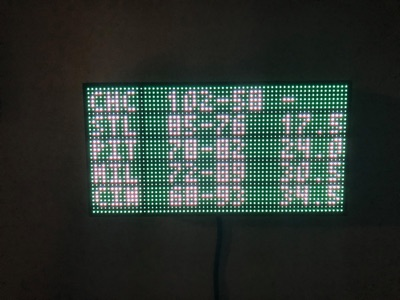

# mlb-led-scoreboard
An LED scoreboard for Major League Baseball. Displays a live scoreboard for your team's game on that day.

Requires a Raspberry PI and an LED board hooked up via the GPIO pins.

[](https://mlb-led-scoreboard.herokuapp.com/)

**Currently supported boards:**
 * 32x32
 * 64x32
 * 128x32
 * 128x64

If you'd like to see support for another set of board dimensions, file an issue!

## Table of Contents
* [Features](#features)
  * [Live Games](#live-games)
  * [Pregame](#pregame)
  * [Division Standings](#division-standings)
* [Installation](#installation)
  * [Hardware Assembly](#hardware-assembly)
  * [Software Installation](#software-installation)
* [Usage](#usage)
  * [Configuration](#configuration)
  * [Flags](#flags)
* [Personalization](#personalization)
  * [Custom Board Layout](#custom-board-layout)
  * [Custom Colors](#custom-colors)
* [Sources](#sources)
  * [Accuracy Disclaimer](#accuracy-disclaimer)
* [Wiki](#wiki)
* [Help and Contributing](#help-and-contributing)
  * [Latest Features](#latest-features)
* [Licensing](#licensing)

## Features

### Live Games
It can display live games in action, and optionally rotate every 15 seconds through each game of the day.

The board refreshes the list of games every 15 minutes.

     

Sometimes you don't get baseball though :(



### Pregame
If a game hasn't started yet, a pregame screen will be displayed with the probable starting pitchers.



### Division Standings
It can display standings for the provided division. Since the 32x32 board is too small to display wins and losses together, the wins and losses are alternated on the board every 5 seconds.

  

## Installation
### Hardware Assembly
[See our wiki page.](https://github.com/MLB-LED-Scoreboard/mlb-led-scoreboard/wiki) This README is primarily focused on the MLB software, but for those coming here from Reddit or elsewhere never having built things with a Raspberry Pi, this should help get you going.

### Software Installation
#### Requirements
You need Git for cloning this repo and PIP for installing the scoreboard software.
```
sudo apt-get update
sudo apt-get install git python-pip
```

#### Installing the scoreboard software
This installation process will take about 10-15 minutes. Raspberry Pis aren't the fastest of computers, so be patient!

```
git clone --recursive https://github.com/MLB-LED-Scoreboard/mlb-led-scoreboard
cd mlb-led-scoreboard/
sudo ./install.sh
```

This will install the rgbmatrix binaries, which we get from [another open source library](https://github.com/hzeller/rpi-rgb-led-matrix/tree/master/bindings/python#building). It controls the actual rendering of the scoreboard onto the LEDs. If you're curious, you can read through their documentation on how all of the lower level stuff works.

It will also install some time zone libraries and [mlbgame](https://github.com/panzarino/mlbgame), a Python library that retrieves all of our baseball data.

If you continue to run into issues, join our Slack channel located at the top of the README.

#### Time Zones
Make sure your Raspberry Pi's timezone is configured to your local time zone. They'll often have London time on them by default.

## Usage
`sudo python main.py` Running as root is 100% an absolute must, or the matrix won't render.

**Adafruit HAT/Bonnet users: You must supply a command line flag:**

`sudo python main.py --led-gpio-mapping="adafruit-hat"`

See the Flags section below for more flags you can optionally provide.

### Configuration

A default `config.json.example` file is included for reference. Copy this file to `config.json` and modify the values as needed.

```
"preferred":                           Options for team and division preference
  "teams"                      Array   Pass an array of preferred teams. The first team in the list will be used as your 'favorite' team. Example: ["Cubs", "Brewers"]
  "divisions"                  Array   Pass an array of preferred divisions that will be rotated through in the order they are entered. Example: ["NL Central", "AL Central"]

"standings":                           Options for displaying standings for a division
  "always_display"             Bool    Display standings for the provided preferred_divisions.
  "mlb_offday"                 Bool    Display standings for the provided preferred_divisions when there are no games on the current day.
  "team_offday"                Bool    Display standings for the provided preferred_divisions when the preferred_teams is not playing on the current day.

"rotation":                            Options for rotation through the day's games
  "enabled"                    Bool    Rotate through each game of the day every 15 seconds.
  "scroll_until_finished"      Bool    If scrolling text takes longer than the rotation rate, wait to rotate until scrolling is done.
  "only_preferred"             Bool    Only rotate through games in your preferred_teams list.
  "rates"                      Dict    Dictionary of Floats. Each type of screen can use a different rotation rate. Valid types: "live", "pregame", "final".
                               Float   A Float can be used to set all screen types to the same rotate rate.

  "while_preferred_team_live":         Options for rotating while your chosen preferred_teams is live
    "enabled"                  Bool    Rotation is enabled while your configured preferred_teams game is live.
    "during_inning_breaks"     Bool    Rotation is enabled while your configured preferred_teams game is live during an inning break.

"end_of_day"                   String  A 24-hour time you wish to consider the end of the previous day before starting to display the current day's games. Uses local time from your pi.
"full_team_names"              Bool    If true and on a 64-wide board, displays the full team name on the scoreboard instead of their abbreviation. This config option is ignored on 32-wide boards. Defaults to true when on a 64-wide board.
"scrolling_speed"              Integer Supports an integer between 0 and 4. Sets how fast the scrolling text scrolls.
"debug"                        Bool    Game and other debug data is written to your console.
"demo_date"                    String  A date in the format YYYY-MM-DD from which to pull data to demonstrate the scoreboard. A value of `false` will disable demo mode.
```

### Flags

You can configure your LED matrix with the same flags used in the [rpi-rgb-led-matrix](https://github.com/hzeller/rpi-rgb-led-matrix) library. More information on these arguments can be found in the library documentation.
```
--led-rows                Display rows. 16 for 16x32, 32 for 32x32. (Default: 32)
--led-cols                Panel columns. Typically 32 or 64. (Default: 32)
--led-chain               Daisy-chained boards. (Default: 1)
--led-parallel            For Plus-models or RPi2: parallel chains. 1..3. (Default: 1)
--led-pwm-bits            Bits used for PWM. Range 1..11. (Default: 11)
--led-brightness          Sets brightness level. Range: 1..100. (Default: 100)
--led-gpio-mapping        Hardware Mapping: regular, adafruit-hat, adafruit-hat-pwm
--led-scan-mode           Progressive or interlaced scan. 0 = Progressive, 1 = Interlaced. (Default: 1)
--led-pwm-lsb-nanosecond  Base time-unit for the on-time in the lowest significant bit in nanoseconds. (Default: 130)
--led-show-refresh        Shows the current refresh rate of the LED panel.
--led-slowdown-gpio       Slow down writing to GPIO. Range: 0..4. (Default: 1)
--led-no-hardware-pulse   Don't use hardware pin-pulse generation.
--led-rgb-sequence        Switch if your matrix has led colors swapped. (Default: RGB)
--led-pixel-mapper        Apply pixel mappers. e.g Rotate:90, U-mapper
--led-row-addr-type       0 = default; 1 = AB-addressed panels. (Default: 0)
--led-multiplexing        Multiplexing type: 0 = direct; 1 = strip; 2 = checker; 3 = spiral; 4 = Z-strip; 5 = ZnMirrorZStripe; 6 = coreman; 7 = Kaler2Scan; 8 = ZStripeUneven. (Default: 0)
```

## Personalization
If you're feeling adventurous (and we highly encourage it!), the sections below outline how you can truly personalize your scoreboard and make it your own!
### Custom Board Layout
You have the ability to customize the way things are placed on the board (maybe you would prefer to see scrolling text for a pregame a bit higher or lower). See the `ledcoords/` directory for more information.

### Custom Colors
You have the ability to customize the colors of everything on the board. See the `ledcolors/` directory for more information.

## Sources
This project relies on two libraries:
[MLBGame](https://github.com/panzarino/mlbgame) is the Python library used for retrieving live game data.
[rpi-rgb-led-matrix](https://github.com/hzeller/rpi-rgb-led-matrix) is the library used for making everything work with the LED board and is included as a submodule, so when cloning, make sure you add `--recursive`.

### Accuracy Disclaimer
The scoreboard is dependent on MLB having their data correct and up to date. If you see any weird data such as wrong pitches or scores or whatever else, MLB is drunk.

## Wiki
The wiki for this project has some cool things you can do to your Raspberry Pi, including steps on making your Pi a dedicated scoreboard runner!

## Help and Contributing
If you run into any issues and have steps to reproduce, open an issue. If you have a feature request, open an issue. If you want to contribute a small to medium sized change, open a pull request. If you want to contribute a new feature, open an issue first before opening a PR.

If you just want to talk, join the Slack channel, see the badge at the top of the README

### Latest Features
The scoreboard follows semantic versioning, for what makes sense for a project like this (it has no consumable API or anything like that). The `master` branch is always kept clean and never updated except for releases. If you want to contribute, make sure your pull request is pointed to `dev`.

## Licensing
This project as of v1.1.0 uses the GNU Public License. If you intend to sell these, the code must remain open source.
