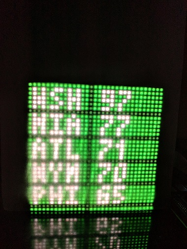

# mlb-led-scoreboard
An LED scoreboard for Major League Baseball. Displays a live scoreboard for your team's game on that day.

Requires a Raspberry PI and an LED board hooked up via the GPIO pins.

## Features

### Live Games
It can display live games in action, and optionally rotate every 15 seconds through each game of the day.

 

### Division Standings
It can display standings for the provided division. Since the 32x32 board is too small to display wins and losses together, the wins and losses are alternated on the board every 5 seconds.

 

## Installation
### Note: The installation steps are very much a WIP as I'm having more people test this out. This will update as more people adopt this software.
```
git clone --recursive https://github.com/ajbowler/mlb-led-scoreboard
cd matrix/bindings/python
```
Then follow the instructions [in that directory](https://github.com/hzeller/rpi-rgb-led-matrix/tree/master/bindings/python#building). The README there will guide you through building the necessary binaries to run the Python samples (stuff like pulsing colors, running text on the screen, etc.)

**You cannot run this program until you have built the RGBMatrix binaries per the instructions in that README.**

A very important note not to forget is setting up the hardware you use. Make sure to edit the Makefile in the `lib/` directory to the right hardware description. I'm using `adafruit-hat` since I built this with an Adafruit HAT.

Then do the following:
```
cd .. # you should be in matrix/bindings now
sudo pip install -e python/
cd ../../ # you should be in mlb-led-scoreboard/ now
sudo pip install mlbgame
make
```
Basically, you're going to go back above the python binding directory, then run a pip install on that directory to create your own `rgbmatrix` module. Then go back up to the project directory and install `mlbgame`, the API this software uses to get baseball stats.

Install anything else your Pi yells at you for. I needed `python-dev` and a few native extensions for other stuff. Outside of scope of this project but this should at least help point people in the right direction.

## Usage
`sudo python main.py` Running as root is 100% an absolute must, or the matrix won't render.

## Example
If you want to just display the game for your team that day, just supply that team. If it's a team like Red Sox, encase it in quotes "Red Sox" so the team is picked up as one command line argument.

`sudo python main.py -t Cubs` or `sudo python main.py -t "Red Sox"`

Passing in a `-r` or `--rotate` flag will rotate through each game of the day every 15 seconds. If you passed a team in, it will start with that game, otherwise it will start with the first game in the list that MLB returned.

To display the standings for a division, supply your division's name.

`sudo python main.py -s "NL Central"` Make sure you follow the format of `NL/AL West/Central/East`

See below for more usage options.

### Flags
```
-h, --help                Show this help message and exit
-t TEAM, --team TEAM      Pick a team to display a game for. Example: "Cubs"
-r, --rotate              Rotate through each game of the day every 15 seconds
-s, --standings DIVISION  Display standings for the provided division. Example: "NL Central"
```

You can configure your LED matrix with the same flags used in the [rpi-rgb-led-matrix](https://github.com/hzeller/rpi-rgb-led-matrix) library. More information on these arguments can be found in the library documentation.
```
--led-rows                Display rows. 16 for 16x32, 32 for 32x32. (Default: 32)
--led-cols                Panel columns. Typically 32 or 64. (Default: 32)
--led-chain               Daisy-chained boards. (Default: 1)
--led-parallel            For Plus-models or RPi2: parallel chains. 1..3. (Default: 1)
--led-pwm-bits            Bits used for PWM. Range 1..11. (Default: 11)
--led-brightness          Sets brightness level. Range: 1..100. (Default: 100)
--led-gpio-mapping        Hardware Mapping: regular, adafruit-hat, adafruit-hat-pwm
--led-scan-mode           Progressive or interlaced scan. 0 = Progressive, 1 = Interlaced. (Default: 1)
--led-pwm-lsb-nanosecond  Base time-unit for the on-time in the lowest significant bit in nanoseconds. (Default: 130)
--led-show-refresh        Shows the current refresh rate of the LED panel.
--led-slowdown-gpio       Slow down writing to GPIO. Range: 0..4. (Default: 1)
--led-no-hardware-pulse   Don't use hardware pin-pulse generation.
--led-rgb-sequence        Switch if your matrix has led colors swapped. (Default: RGB)
--led-row-addr-type       0 = default; 1 = AB-addressed panels. (Default: 0)
--led-multiplexing        Multiplexing type: 0 = direct; 1 = strip; 2 = checker; 3 = spiral. (Default: 0)
```

## Sources
This project relies on two libraries:
[MLBGame](https://github.com/panzarino/mlbgame) is the Python library used for retrieving live game data.
[rpi-rgb-led-matrix](https://github.com/hzeller/rpi-rgb-led-matrix) is the library used for making everything work with the LED board and is included as a submodule, so when cloning, make sure you add `--recursive`.

## 2017-2018 Offseason
Since it's currently the offseason I'm hardcoding everything to random games for testing purposes. I'll update to be "today's game" when the season starts otherwise this thing is useless. I can't guarantee accurate data until it starts either.

See you during the season!


